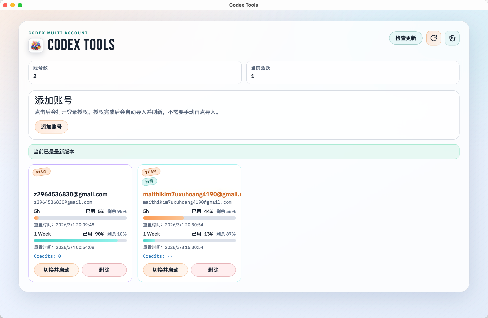

# Codex Tools

一个基于 **React + Tauri** 的桌面工具，用来管理多个 Codex 账号，并提供本地 API 反代能力：
- 查看账号用量
- 快速切换和启动 Codex
- 本地 `/v1` 反代
- cloudflared 公网访问

仓库地址：<https://github.com/170-carry/codex-tools>

## 更新日志
[更新日志](changelog.md)

## Cursor API反代功能提示
1. 通过 Cursor 官网 下载并安装 Cursor。

2. 在 Cursor 中，点击2026-02-03_16-52-37图标，单击Cursor Settings，选择Models页面。

3. 开启 OpenAI API Key，填入您的 API Key。

4. 开启 Override OpenAI Base URL，填入地址。

5. 在Add or search model文本框中，输入Coding Plan支持的模型中的模型名称，点击Add Custom Model。

6. 添加模型名称为gpt-5-4 （目前只支持这个一个）

## 应用截图



## 解决codex-tools app 已损坏的方案

> https://zhuanlan.zhihu.com/p/135948430

> 省流:

> sudo spctl  --master-disable

> sudo xattr -r -d com.apple.quarantine /Applications/Codex\ Tools.app

## 快速启动（本地开发）

### 1) 环境准备

- Node.js 20+
- Rust stable
- macOS 或 Windows（优先支持 macOS）

### 2) 安装依赖

```bash
npm install
```

### 3) 启动桌面应用

```bash
npm run tauri dev
```

就这三步。

## 主要功能

### 1. 账号管理

- 支持 OAuth 登录导入
- 支持上传单个或多个 `.json` 文件批量导入
- 支持直接读取文件夹下的全部 `.json` 文件
- 导入结束后会恢复当前本机登录态，不覆盖你正在使用的账号

### 2. 用量查看与智能切换

- 展示每个账号的 **5h**、**1week** 用量窗口和计划类型
- 支持手动刷新，也会定时自动刷新
- 支持按余量排序和智能切换到更合适的账号

### 3. 切换账号并联动本机环境

- 一键切换账号并启动 Codex
- 找不到桌面应用时自动回退到 `codex app`
- 可选同步 Opencode OpenAI 授权
- 可选在切换后重启已选编辑器

### 4. API 反代

- 本地提供 OpenAI 兼容的 `/v1` 接口
- 使用已登录的 Codex 账号作为上游能力来源
- 支持固定端口、自定义端口、固定 API Key 和手动刷新 API Key
- 按账号余量自动挑选可用账号进行转发
- 可设置应用启动时自动启动 API 反代

### 5. 公网访问与桌面能力

- 集成 cloudflared，可将本地反代暴露到公网
- 支持快速隧道和命名隧道，可选 HTTP/2
- 支持后台驻留、状态栏菜单、应用内更新和多语言界面

API 反代详细链路见 [docs/api-proxy.md](docs/api-proxy.md)。

## 打包与发布（简版）

本项目已配置 GitHub Actions 自动发布（mac 双架构 + Windows）。

触发发布：

```bash
git tag v0.1.3
git push origin v0.1.3
```

查看：
- 代码仓库: <https://github.com/170-carry/codex-tools>
- 版本发布: <https://github.com/170-carry/codex-tools/releases>

## 目录说明

- 前端：`src/`
- Tauri / Rust：`src-tauri/`
- 发布流程：`.github/workflows/release.yml`

## Star History

<a href="https://www.star-history.com/?repos=170-carry/codex-tools&type=date&legend=top-left">
 <picture>
   <source media="(prefers-color-scheme: dark)" srcset="https://api.star-history.com/image?repos=170-carry/codex-tools&type=date&theme=dark&legend=top-left" />
   <source media="(prefers-color-scheme: light)" srcset="https://api.star-history.com/image?repos=170-carry/codex-tools&type=date&legend=top-left" />
   
 </picture>
</a>

## License

MIT，详见 [LICENSE](LICENSE)。
